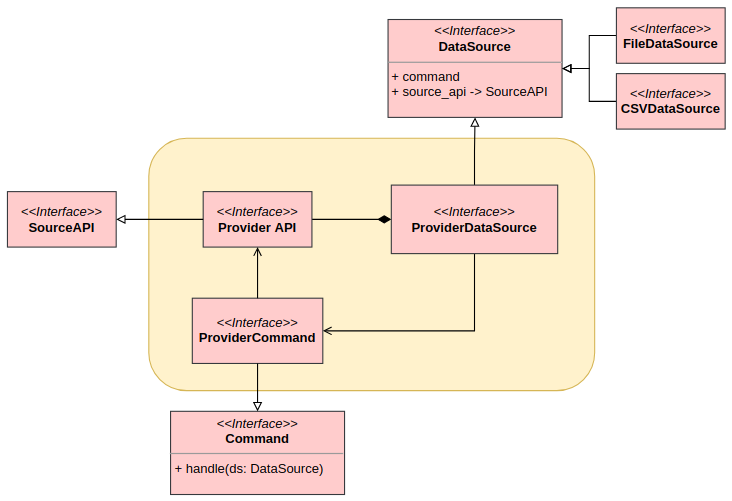
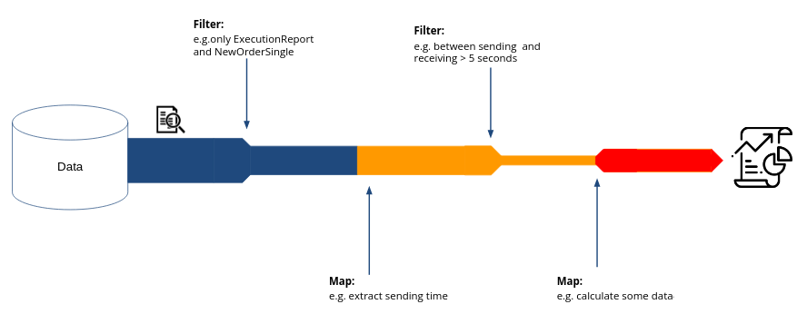

[](https://www.python.org/downloads/)
[](https://github.com/th2-net/th2-data-services/releases/latest)


Table of Contents
=================

<!--ts-->
* [Table of Contents](#table-of-contents)
* [1. Introduction](#1-introduction)
* [2. Getting started](#2-getting-started)
   * [2.1. Installation](#21-installation)
      * [Core](#core)
      * [Data sources (providers)](#data-sources-providers)
      * [GRPC provider warning](#grpc-provider-warning)
         * [Reasons for the restriction](#reasons-for-the-restriction)
   * [2.2. Example](#22-example)
   * [2.3. Short theory](#23-short-theory)
      * [Terms](#terms)
      * [Concept](#concept)
      * [Stream operations](#stream-operations)
         * [Pipelining](#pipelining)
         * [Internal iteration](#internal-iteration)
      * [Data caching](#data-caching)
         * [Forced caching](#forced-caching)
      * [EventsTree and collections](#eventstree-and-collections)
         * [EventsTree](#eventstree)
         * [Collections](#collections)
         * [Hints](#hints)
   * [2.4. Links](#24-links)
* [3. API](#3-api)
* [4. Examples](#4-examples)
   * [4.1. Notebooks](#41-notebooks)
   * [4.2. *.py](#42-py)
<!--te-->

# 1. Introduction

This repository is a library for creating th2-data-services applications.
Data Services allows you to manipulate the stream data processing workflow using pipelining.

The library's features:

- Provides core interface for developing data source implementations
- Work with iterable objects (list, tuple, etc including files) via _Data object_ using its features
- Manipulate the workflow to make some analysis by _Data object_ methods
- Use timestamp converter implementations or use base class to create custom converters
- Build Event Trees (EventTree, EventTreeCollection and ParentEventTreeCollection classes)

Workflow manipulation tools allows you:

- Filtering stream data (`Data.filter` method)
- Transforming stream data (`Data.map` method)
- Limiting the number of processed streaming data (`Data.limit` method)

There is also another part of _data services_

- [th2-data-services-utils](https://github.com/th2-net/th2-data-services-utils). It's a set of tools to perform the most
  common analysis tasks.

# 2. Getting started

## 2.1. Installation

### Core

- From PyPI (pip)   
  This package can be found on [PyPI](https://pypi.org/project/th2-data-services/ "th2-data-services").
    ```
    pip install th2-data-services
    ```

- From Source
    ```
    git clone https://github.com/th2-net/th2-data-services
    pip install th2-data-services/
    ```

### Data sources (providers)

Since `v1.3.0`, the library doesn't provide data source dependencies.

You should provide it manually during installation. 
You just need to add square brackets after library name and put dependency name.

```
pip install th2-data-services[dependency_name]
```

**Dependencies list** 

| dependency name | provider version          |
|:---------------:|---------------------------|
|      lwdp       | latest version of lwdp    |
|      lwdp2      | latest version of lwdp v2 |

**Example**

```
pip install th2-data-services[lwdp1]
```

## 2.2. Example

A good, short example is worth a thousand words.

This example shows basic usage of library's features.

[The following example as a file](examples/get_started_example.py).

<!-- start get_started_example.py -->
```python
from collections import Generator
from typing import Tuple, List, Optional
from datetime import datetime
from th2_data_services.utils.converters import DatetimeConverter, DatetimeStringConverter, ProtobufTimestampConverter

from th2_data_services import Data

# [0] Lib configuration
# [0.1] Interactive or Script mode
# If you use the lib in interactive mode (jupyter, ipython) it's recommended to set the special
# global parameter to True. It'll keep cache files if something went wrong.
import th2_data_services

th2_data_services.INTERACTIVE_MODE = True

# Some example data
events = Data([
    {
        "eventId": "demo_book_1:th2-scope:20230105135705560873000:d61e930a-8d00-11ed-aa1a-d34a6155152d_1",
        "batchId": None,
        "isBatched": False,
        "eventName": "Set of auto-generated events for ds lib testing",
        "eventType": "ds-lib-test-event",
        "endTimestamp": {"epochSecond": 1672927025, "nano": 561751000},
        "startTimestamp": {"epochSecond": 1672927025, "nano": 560873000},
        "parentEventId": None,
        "successful": True,
        "bookId": "demo_book_1",
        "scope": "th2-scope",
        "attachedMessageIds": [],
        "body": [],
    },
    {
        "eventId": "demo_book_1:th2-scope:20230105135705563522000:9adbb3e0-5f8b-4c28-a2ac-7361e8fa704c>demo_book_1:th2-scope:20230105135705563522000:d61e930a-8d00-11ed-aa1a-d34a6155152d_2",
        "batchId": "demo_book_1:th2-scope:20230105135705563522000:9adbb3e0-5f8b-4c28-a2ac-7361e8fa704c",
        "isBatched": True,
        "eventName": "Plain event 1",
        "eventType": "ds-lib-test-event",
        "endTimestamp": {"epochSecond": 1672927025, "nano": 563640000},
        "startTimestamp": {"epochSecond": 1672927025, "nano": 563522000},
        "parentEventId": "demo_book_1:th2-scope:20230105135705560873000:d61e930a-8d00-11ed-aa1a-d34a6155152d_1",
        "successful": True,
        "bookId": "demo_book_1",
        "scope": "th2-scope",
        "attachedMessageIds": [],
        "body": {"type": "message", "data": "ds-lib test body"},
    },
    {
        "eventId": "demo_book_1:th2-scope:20230105135705563522000:9adbb3e0-5f8b-4c28-a2ac-7361e8fa704c>demo_book_1:th2-scope:20230105135705563757000:d61e930a-8d00-11ed-aa1a-d34a6155152d_3",
        "batchId": "demo_book_1:th2-scope:20230105135705563522000:9adbb3e0-5f8b-4c28-a2ac-7361e8fa704c",
        "isBatched": True,
        "eventName": "Plain event 2",
        "eventType": "ds-lib-test-event",
        "endTimestamp": {"epochSecond": 1672927025, "nano": 563791000},
        "startTimestamp": {"epochSecond": 1672927025, "nano": 563757000},
        "parentEventId": "demo_book_1:th2-scope:20230105135705560873000:d61e930a-8d00-11ed-aa1a-d34a6155152d_1",
        "successful": True,
        "bookId": "demo_book_1",
        "scope": "th2-scope",
        "attachedMessageIds": [],
        "body": {"type": "message", "data": "ds-lib test body"},
    }
])

# [1] Working with a Data object.
# [1.1] Filter.
filtered_events: Data = events.filter(lambda e: e["body"] != [])  # Filter events with empty body.


# [1.2] Map.
def transform_function(record):
    return {"eventName": record["eventName"], "successful": record["successful"]}


filtered_and_mapped_events = filtered_events.map(transform_function)


# [1.3] Data pipeline.
#       Instead of doing data transformations step by step you can do it in one line.
filtered_and_mapped_events_by_pipeline = events.filter(lambda e: e["body"] != []).map(transform_function)
# Content of these two Data objects should be equal.
assert list(filtered_and_mapped_events) == list(filtered_and_mapped_events_by_pipeline)

# [1.4] Sift. Skip the first few items or limit them.
data = Data([1,2,3,4,5,6,7,8,9,10,11,12,13,14,15])
items_from_11_to_end: Generator = data.sift(skip=10)
only_first_10_items: Generator = data.sift(limit=10)

# [1.5] Changing cache status.
events.use_cache(True)
# or just
events.use_cache()  # If you want to activate cache.
# [1.6] Walk through data.
for event in events:
    # Do something with event (event is a dict).
    print(event)
# After first iteration the events has a cache file.
# Now they will be used in the cache in the next iteration.

# [1.7] Get number of the elements in the Data object.
number_of_events = events.len

# [1.8] Check that Data object isn't empty.
# The data source should be not empty.
assert events.is_empty is False

# [1.9] Convert Data object to the list of elements(events or messages).
# Be careful, this can take too much memory.
events_list = list(events)

# [1.10] The cache inheritance.
# Creates a new Data object that will use cache from the events Data object.
events_filtered: Data = events.filter(lambda record: record.get("batchId"))

# New Data objects don't use their own cache by default but use the cache of the parent Data object.
# Use use_cache method to activate caching.
# After that, the Data object will create its own cache file.
events_filtered.use_cache()

list(events_filtered)  # Just to iterate Data object (cache file will be created).

filtered_events_types = events_filtered.map(lambda record: {"eventType": record.get("eventType")})

events_without_types_with_batch = filtered_events_types.filter(lambda record: not record.get("eventType"))
events_without_types_with_batch.use_cache()

# [1.11] Data objects joining.
# You have the following 3 Data objects.
d1 = Data([1, 2, 3])
d2 = Data(["a", {"id": 123}, "c"])
d3 = Data([7, 8, 9])
# You can join Data objects in following ways.
# Please note, new Data object will have cache status == False.
data_via_init = Data([d1, d2, d3])
data_via_add = d1 + d2 + d3
data_with_non_data_obj_via_init = Data([d1, ["a", {"id": 123}, "c"], d3])
data_with_non_data_obj_via_add = d1 + ["a", {"id": 123}, "c"] + d3
# You can join current Data object on place using +=.
# It will keep cache status.
d1 += d3  # d1 will become Data([1,2,3,7,8,9])

# [1.12] Build and read Data object cache files.
events.build_cache("cache_filename_or_path")
data_obj_from_cache = Data.from_cache_file("cache_filename_or_path")


# [2] Working with converters.
# There are currently three implementations of ITimestampConverter class: DatetimeConverte, DatetimeStringConverter and ProtobufTimestampConverter.
# They all implement same methods from base class.
# Note that some accuracy may be lost during conversion.
# If for example you use to_microseconds nanoseconds will be cut off instead of rounding.

# [2.1] DatetimeConverter.
# DatetimeConverter takes datetime.datetime object as input.

datetime_obj = datetime(year=2023, month=1, day=5, hour=14, minute=38, second=25, microsecond=1460)

# It has methods that return the datetime in different formas:

date_ms = DatetimeConverter.to_milliseconds(datetime_obj)
date_us = DatetimeConverter.to_microseconds(datetime_obj)
# Converting to nanoseconds justs adds three trailing zeros as datetime object doesn't have nanoseconds.
date_ns = DatetimeConverter.to_nanoseconds(datetime_obj)

# [2.2] DatetimeStringConverter
# DatetimeStringConverter takes string in "yyyy-MM-ddTHH:mm:ss[.SSSSSSSSS]Z" format.

date_string = "2023-01-05T14:38:25.00146Z"

# We have same methods as in DatetimeConverter
date_ms_from_string = DatetimeStringConverter.to_milliseconds(date_string)
date_us_from_string = DatetimeStringConverter.to_microseconds(date_string)
date_ns_from_string = DatetimeStringConverter.to_nanoseconds(date_string)

# We can also get datetime object from string
datetime_from_string = DatetimeStringConverter.to_datetime(date_string)

# [2.3] ProtobufTimestampConverter
# Protobuf timestamps must be in form {"epochSecond": seconds, "nano": nanoseconds}

protobuf_timestamp = {"epochSecond": 1672929505, "nano": 1_460_000}

date_ms_from_timestamp = ProtobufTimestampConverter.to_milliseconds(protobuf_timestamp)
date_us_from_timestamp = ProtobufTimestampConverter.to_microseconds(protobuf_timestamp)
date_ns_from_timestamp = ProtobufTimestampConverter.to_nanoseconds(protobuf_timestamp)
datetime_from_timestamp = ProtobufTimestampConverter.to_datetime(protobuf_timestamp)

```
<!-- end get_started_example.py -->

## 2.3. Short theory

The library provides tools for handling stream data. What’s a stream? It's a sequence of elements from a source that
supports aggregate operations.

### Terms

- **Data object**: An instance of `Data` class which is wrapper under stream.
- **Sequence of elements**:
  A _Data object_ provides an interface to a sequenced set of values of a specific element type. Stream inside the _Data
  object_ **don’t actually store** elements; they are computed on demand.
- **data source** (exactly in small letters):
  Any source of data. E.g. [Lightweight Data Provider](https://github.com/th2-net/th2-lw-data-provider), collections,
  arrays, or I/O resources.
- **DataSource**:
  A class that is an intermediate link between the SourceAPI and Commands.
- **SourceAPI**:
  Each source has its own API to retrieve data. SourceAPI is a class that provide API for some data source.
- **Commands**:
  Classes that provide user-friendly interfaces for getting some data from DataSource. Commands use _SourceAPI_ to
  achieve it.
- **Adapters**:
  It's similar to function for `Data.map` method. Adoptable commands used it to update the data stream.
- **Aggregate operations**:
  Common operations such as filter, map, limit and so on.
- **Workflow**: An ordered set of _Aggregate operations_.

### Concept

The library describes the high-level interfaces `ISourceAPI`, `IDataSource`, `ICommand`, `IAdapter`.

Any data source must be described by the `IDataSource` abstract class. These can be _FileDataSource_, 
_CSVDataSource_, _DBDataSource_ and other.

Usually, data sources have some kind of API. Databases - provide SQL language, when working with a file, you can read
line by line, etc. This API is described by the `ISourceAPI` class. Because different versions of the same data source
may have different API, it is better to create a class for each version.

Generally, data source APIs are hidden behind convenient interfaces. The role of these interfaces is played
by `ICommand` classes.

`IAdapter` classes transform data stream like functions for `Data.map` method. Essentially it's the same thing but more
flexible.

For example, LwDP DataSource(https://github.com/th2-net/th2-ds-source-lwdp) uses these abstract classes to build its implementation.You can easily create your own unique commands for _LwDP DataSource_, as well as entire
_DataSource_ classes. [Here is a documentation](documentation/datasource.md) on how to implement these interfaces.



### Stream operations

Furthermore, stream operations have two fundamental characteristics that make them very different from collection
operations: _Pipelining_ and _Internal iteration_.

#### Pipelining

Many stream operations return a stream themselves. This allows operations to be chained to form a larger pipeline.



#### Internal iteration

In contrast to collections, which are iterated explicitly (external iteration), stream operations do the iteration
behind the scenes for you. Note, it doesn't mean you cannot iterate the _Data object_.

### Data caching

The _Data object_ provides the ability to use the cache. The cache works for each _Data object_, that is, you choose
which _Data object_ you want to save. The _Data object_ cache is saved after the first iteration, but the iteration
source may be different.

If you don't use the cache, your source will be the data source you have in the _Data Object_. But if you use the cache,
your source can be the data source, the parent cache, or own cache:

* The data source:
  If the _Data Object_ doesn't have a parent cache and its cache.
* The parent cache:
  If the _Data Object_ has a parent cache. It doesn't matter what position the parent cache has in inheritance.
  _Data Object_ understands whose cache it is and executes the part of the workflow that was not executed.
* The own cache:
  If it is not the first iteration of this Data object.

Note that the cache state of the Data object is not inherited.

#### Forced caching
You can tell DS to cache data to specific cache file, which won't be deleted after script end.
You can see example in 1.12 section of [get_started_example](examples/get_started_example.py).


### EventTree and collections

#### EventTree

`EventTree` is a tree-based data structure of events. It allows you get children and parents of event, 
display tree, get full path to event etc.

Details:

* `EventTree` contains all events in memory.
* Tree has some important terms:
    1. _Ancestor_ is any relative of the event up the tree (grandparent, parent etc.).
    2. _Parent_ is only the first relative of the event up the tree.
    3. _Child_ is the first relative of the event down the tree.

Take a look at the following HTML tree to understand them.

   ```
    <body> <!-- ancestor (grandparent), but not parent -->
        <div> <!-- parent & ancestor -->
            <p>Hello, world!</p> <!-- child -->
            <p>Goodbye!</p> <!-- sibling -->
        </div>
    </body>
   ```

#### Collections

**EventTreeCollection** is a collection of EventTrees. The collection builds a few _EventTree_ by passed _Data
object_. Although you can change the tree directly, it's better to do it through collections because they are aware of
`detached_events` and can solve some events dependencies. The collection has similar features like a single _EventTree_
but applying them for all _EventTrees_.

**ParentEventTreeCollection** is a collection similar to _EventTreeCollection_ but containing only parent events that
are referenced in the data stream. The collection has features similar to _EventTreeCollection_.

Details:

* To use ET collections you need to initialize them by _ETCDriver_. Data sources usually provide them.
  You can create it by yourself depending on your data structure.  
* The collection has a feature to recover events. All events that are not in the received data stream, but which are
  referenced will be loaded from the data source.
* You can take `detached_events` to see which events are missing.
* If you want, you can build parentless trees where the missing events are stubbed instead. Just
  use `get_parentless_trees()`.

Requirements:

1. Events provided to ETC have to have `event_name`, `event_id`, `parent_event_id` fields. They 
can have another names (it resolves in the driver).

#### Hints

* Remove all unnecessary fields from events before passing to a _collection_ to reduce memory usage.
* Use `show()` method to print the tree in tree-like view.
* Note that the `get_x` methods will raise an exception if you pass an unknown event id, unlike the `find_x` methods (
  they return None).
* If you want to know that specified event exists, use the python `in` keyword (e.g. `'event-id' in events_tree`).
* Use the python `len` keyword to get events number in the tree.

## 2.4. Links

- [Report Data Provider](https://github.com/th2-net/th2-rpt-data-provider)
- [Th2 Data Services Utils](https://github.com/th2-net/th2-data-services-utils)

# 3. Official DataSource implementations

- [Lightweight Data Provider Data Source](https://github.com/th2-net/th2-ds-source-lwdp)


# 4. API

If you are looking for classes description see the [API Documentation](documentation/api/index.md).

# 5. Examples

- [get_started_example.py](examples/get_started_example.py)
  