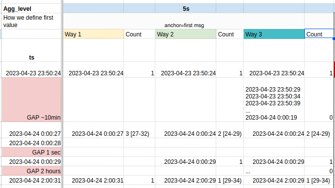
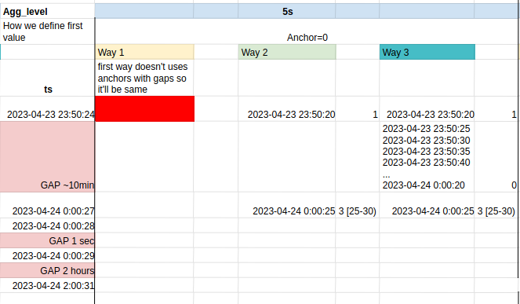

# get_category_frequencies

get_category_frequencies is a function that takes in data of messages and returns a table, where messages are aggregated in rows based on their timestamp and grouped in column based on categorizer function we provide. Timestamp aggregation logic is defined by 3 arguements: aggregation_level, gap_mode and zero_anchor. While aggregation_level is pretty self-explanatory as it just defines the range of aggregation, gap_mode and zero_anchor are a bit tricky.

## gap_mode

## zero_anchor

When zero_anchor=True timestamp anchor script uses is set to 0. This means that every range is 0 + some integer * aggregation_level and anchor is not some message's timestamp from our data. For this reason it's better to not use zero_anchor=True and gap_mode=1 together as we might get unexpected results.

## Example - zero_anchor = False

We can see that gap_mode=1 doesn't have equal distances between its ranges. Its range always start with existing timestamp in messages.
gap_mode=2 and gap_mode=3 always have equal distances, meaning for example: If first range started on 2023-04-23 23:50:24, other ranges will be this timestamp + aggregation_level * some integer.
gap_mode=3 just adds empty ranges in between the ranges with value in it.

## Example - zero_anchor = True

As said before we shouldn't use gap_mode=1 with zero_anchor.
For gap_mode=2 and 3 we see that first range doesn't start with existing timestamp from data, but rather a value that is divisible by aggregation_level.