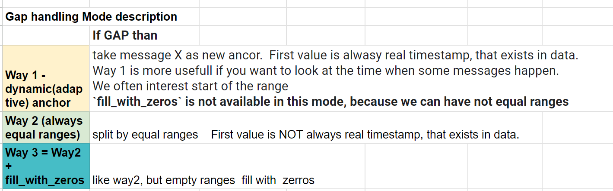

# get_category_frequencies

get_category_frequencies is a function that takes in data of messages and returns a table, where messages are aggregated in rows based on their timestamp and grouped in column based on categorizer function we provide. Timestamp aggregation logic is defined by 3 arguements: aggregation_level, gap_mode and zero_anchor. While aggregation_level is pretty self-explanatory as it just defines the range of aggregation, gap_mode and zero_anchor are a bit tricky.

## gap_mode

## zero_anchor

When zero_anchor=True timestamp anchor script uses is set to 0. This means that every range is 0 + some number * aggregation_level and anchor is not some message's timestamp from our data. For this reason it's better to not use zero_anchor=True and gap_mode=1 together as we might get unexpected results.